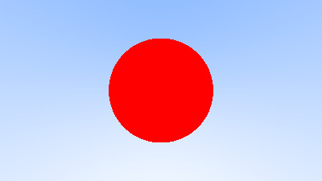
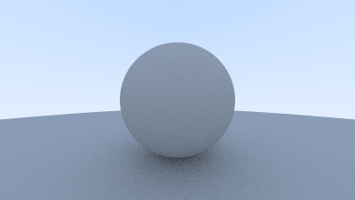

# Tracer

A simple raytracer, based on [Ray Trancing in One Weekend](https://raytracing.github.io/books/RayTracingInOneWeekend.html).

## How to Use

Either use the vscode tasks `cmake` and `build` or manually:
```sh
$ mkdir build && cd build
$ cmake ..
$ cmake --build .
```

Run the script using:
```sh
$ ./build/src/tracer > image.ppm
$ mogrify -format jpg *.ppm # optional
```

## Updates

A single object in the scene.


---

Coloring the sphere based on the direction of the normal vector (first image is a bug).


---

Adding more objects to our world.


---

Adding anti-aliasing with 5, 10, and 50 samples for pixel, respectively.


---

Adding a mate texture to our spheres with 10 and 100 samples per pixel, respectively.


---

Removing shadow acne.


---

Improving light reflection by using a lambertian distribution.


---

Applying gamma correction.


---

Adding new materials: lambertian and fuzzy metal.


---

Adding new materials: dielectrics and hollow glass sphere.


