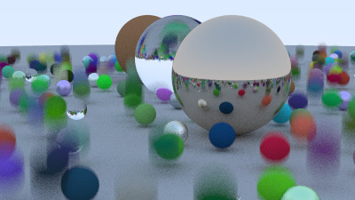

# Performance

## Multi-Threading

## Bounding Volume Hierarchy

Benchmark on a scene with ~100 objects, 100 samples per pixel and 50 maximum ray depth.

|                     | rendering time  |
|---------------------|-----------------|
| single thread       | 405.43s         |
| single thread + BVH | 49.79s          |
| four threads        | 140.45s         |
| four threads + BVH  | 21.83s          |

Rendered image:

